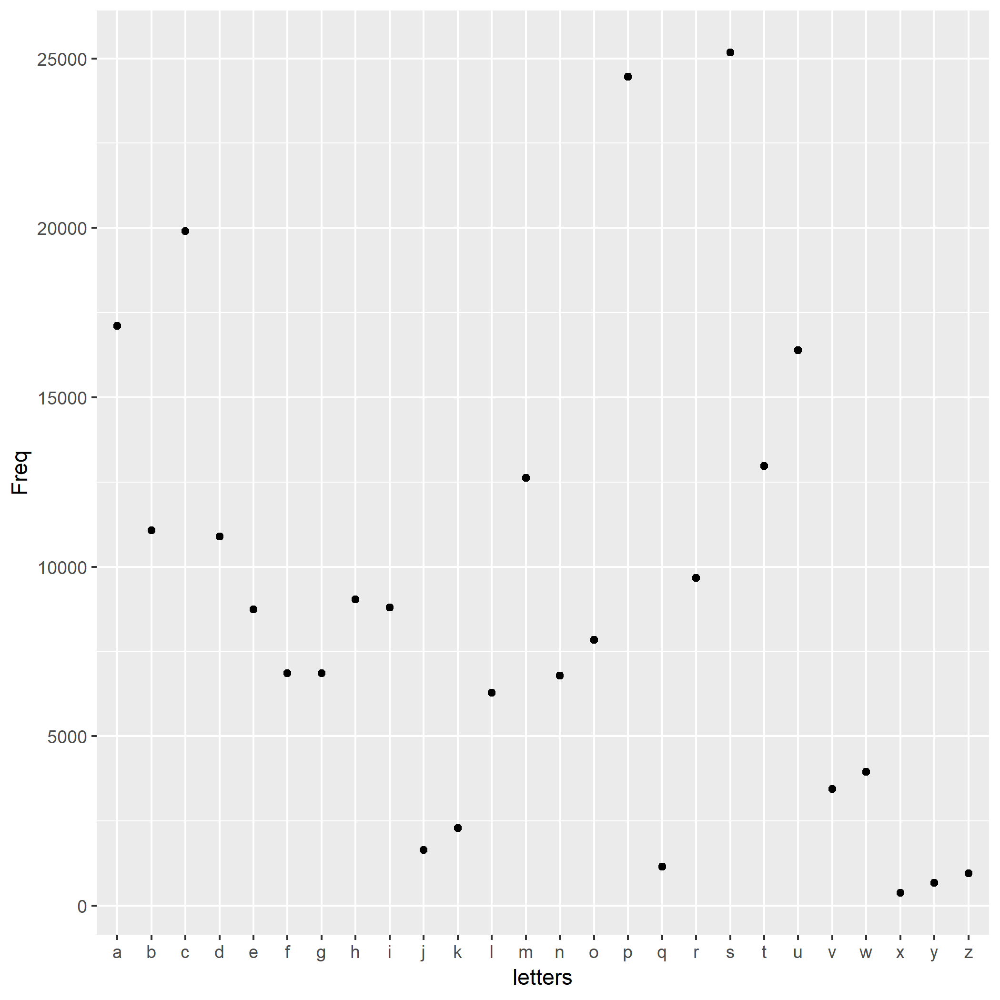

```{r setup, include=FALSE}
```

This report is about the words.txt file, which can be downloaded [here](https://github.com/STAT545-UBC/make-activity/blob/master/words.txt).
The following plot shows the frequency distribution of all letters in the alphabet and how often they are used as the first letter in `words.txt`.


